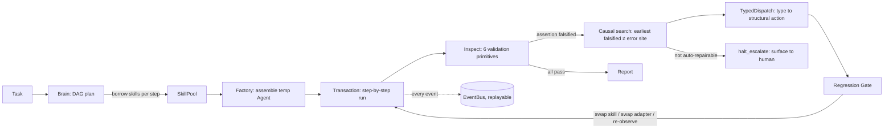

# HiveSwarm

> **The problem**: when an LLM agent fails mid-way through a long, multi-step task — a tool returns the wrong shape, a value gets silently corrupted, a dependency chain breaks — mainstream frameworks have only two moves: blind retry, or stuffing a one-line "diagnosis" back into the next prompt (guidance adherence drops below 50% within 8–13 steps). **HiveSwarm moves failure recovery from the language layer to the structure layer: the output of a diagnosis is not a sentence, it's an assembly change.**

## Core idea: Skills are borrowed, not bound

Skills are not bound to long-lived agents. They live in a pool and are **checked out per task and forcibly returned** (reference counting, return-on-exception, double-return raises). Every agent is a temporary assembly that is destroyed after its task.

This solves two real problems:
1. **No resource leaks** — no matter how many skills exist, none are pre-installed on every agent;
2. **A hard boundary for permissions and side effects** — an agent can only call the skills it borrowed; anything outside its bundle is structurally absent.

## Architecture



**Three mechanisms** (the reliability core; all deterministic code, no reliance on model obedience):
- **M1 Assertion contract layer** — constraints proposed by the LLM must compile into one of 6 validation primitives to enter the ledger; anything else is dropped (no fake constraints);
- **M2 Type-driven structural repair** — a falsified assertion's `(kind, predicate class)` maps through a complete dispatch table to exactly one structural action; reverse graph search locates the **earliest** falsified assertion, not the error site; a regression gate guarantees "fix A without breaking B";
- **M3 Verification ladder** — assertions that pass N≥3 consecutive observations are auto-promoted from post-hoc checks to pre-call interception; any falsification demotes them immediately; every promotion/demotion is an auditable event.

## Measured numbers (actually run — no projected values)

| Item | Value | How |
|---|---|---|
| Unit tests | **513 passed, 1 skipped** | `pytest tests/unit/ -q`; skip = manual network test |
| Warnings | **0** (error-level filter on) | `filterwarnings = ["error"]` in pyproject |
| Coverage | **87% overall; 91% core+layers** | `pytest --cov=core --cov=layers --cov=stub` |
| Criteria compilable | 31/31 = 100% | every criterion in the 30-task set compiles into a validation primitive |

Mechanism comparison experiment (mock pipeline, **demo data — not real-model measurements**, see `experiments/runs/demo/report.md`): under three-way comparison, value/pollution failures are recovered only by group C (HiveSwarm) with 100% root-cause localization, and persistent chain breaks are honestly escalated rather than fake-fixed. **Real-model numbers will replace these after running on ModelScope Qwen.**

## Quick start (commands verified by actually running them)

```bash
git clone <repo-url> && cd hiveswarm
pip install pydantic litellm fastapi uvicorn httpx   # core deps
python -m pytest tests/unit/ -q                      # 513 passed
python -m src.main "帮我做一个 PPT"                   # runs with mock fallback, no API key needed
```

Optional: `pip install gradio reportlab python-pptx` (dashboard / PDF reports / real PPT), `pip install -e .` (dev toolchain).

HTTP gateway: `uvicorn gateway.app:create_app --factory --port 8000` then `GET /health`, `/docs`.
Dashboard: `python dashboard_dump.py` (offline snapshot) or `GradioDashboard.launch()`.

## Experiment machine (`experiments/`)

A 30-task benchmark (serial / branching / hallucination-prone × 10) + 25 failure-injection points (5 categories × 5, independently switchable) + a three-way comparison runner (bare model / simple retry harness / full mechanisms), with resumable runs and per-run traces on disk.

```bash
python -m experiments.run_demo --subset 2   # 6-task smoke run
python -m experiments.run_demo              # full mock run (1221 traces)
```

## Repository layout

```
core/          core contracts (ABCs): event bus / skill / agent / brain / governance
layers/
  brain/       DAG planning (mock / LLM)
  work/        skill pool / borrow-return transaction / temp assembly
  inspect/     6 validation primitives + composable checks + LLM judge
  contract/    mechanisms M1/M2/M3: assertion contracts / causal search / ladder
  repair/      typed dispatch + regression gate + re-assembly
  monitor/     health snapshots / event log
  report/      delivery report generation
experiments/   benchmark tasks / failure injection / three-way runner / metrics
stub/          swappable default implementations (auth / audit / billing / tenant / breaker...)
skills/        skill packs: crawler / ppt / web_search / agentvet
gateway/       FastAPI gateway (auth middleware + REST)
```

## Docs

Chinese README: [README.md](README.md) · [Architecture](docs/ARCH.md) · [Interfaces](docs/INTERFACES.md) · [HOW_TO_REPLACE](docs/HOW_TO_REPLACE.md)

## License

MIT
