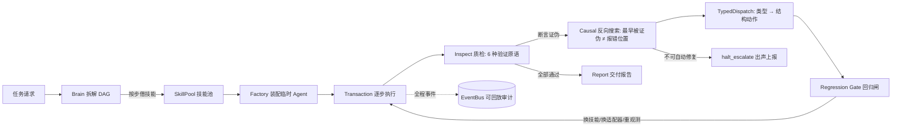

# HiveSwarm

> **解决的问题**：LLM Agent 在长程多步任务里一旦中途失败——工具返回格式不对、值被污染、依赖断链——主流框架只有两招：盲目重试，或者把"诊断结论"写一句话塞回下一轮 prompt（8–13 步后 adherence 掉到 50% 以下）。**HiveSwarm 把失败修复从"语言层"搬到"结构层"：诊断的输出不是一句话，是一次装配变更。**

## 核心创新：Skills are borrowed, not bound

工具技能不绑定在常驻 Agent 身上，而是放在池子里**按任务借出、用完强制归还**（引用计数 + 异常路径也归还 + 二次归还直接报错）。每个 Agent 是"用完即毁"的临时装配体。

这解决了两个真实问题：
1. **资源不泄漏**——技能再多也不会预先装死在每个 Agent 上；
2. **权限/副作用有物理边界**——Agent 只能调用它借到的技能，bundle 之外的能力在结构上不存在。

## 架构



**榫卯三机制**（可靠性核心，全部确定性程序，不依赖模型自觉）：
- **M1 断言契约层**——LLM 提的约束必须编译成 6 种验证原语之一才能进账本，编不过即丢弃（杜绝假约束）；
- **M2 类型驱动结构修复**——被证伪断言的 `(种类, 谓词类型)` 查完备 dispatch 表得出唯一结构动作；反向图搜索定位**最早**被证伪的断言而非报错位置；回归闸保证"修 A 不坏 B"；
- **M3 验证阶梯**——连续 N≥3 次稳定通过的断言自动从"事后检查"升到"事前拦截"，被证伪立刻降级，全程事件可审计。

## 实测数据（真实跑出来的，不写预期值）

| 项 | 数字 | 口径 |
|---|---|---|
| 单元测试 | **513 passed, 1 skipped** | `pytest tests/unit/ -q`；skip 为手动联网用例 |
| warnings | **0**（error 级过滤生效） | pyproject `filterwarnings = ["error"]` |
| 测试覆盖率 | **合计 87%；core+layers 91%** | `pytest --cov=core --cov=layers --cov=stub` |
| 判据可编译率 | 31/31 = 100% | 30 题任务集的判据全部能编译成验证原语 |

机制对照实验（mock 管线，**演示数据非实测**，见 `experiments/runs/demo/report.md`）：三方对照下，值污染/中间量污染类失败只有 C 组（榫卯）恢复且根因定位命中 100%，持久断链类 C 组诚实上报而非假装修复。**真实模型数字待魔搭 Qwen 实跑后替换。**

## 快速开始（以下命令实测可跑）

```bash
git clone <repo-url> && cd hiveswarm
pip install pydantic litellm fastapi uvicorn httpx   # 核心依赖
python -m pytest tests/unit/ -q                      # 513 passed
python -m src.main "帮我做一个 PPT"                   # 无 API key 也跑 mock 兜底
```

可选：`pip install gradio reportlab python-pptx`（看板 / PDF 报告 / 真 PPT 生成）、`pip install -e .`（开发工具链）。

HTTP 网关：`uvicorn gateway.app:create_app --factory --port 8000` → `GET /health`、`/docs`。
战情看板：`python dashboard_dump.py`（离线快照）或用 `GradioDashboard.launch()`。

## 实验机器（`experiments/`）

30 题任务集（串行/分支/易幻觉三类 × 10）+ 25 个失败注入点（5 类 × 5，独立开关）+ 三方对照 runner（裸模型 / 简单重试 harness / 榫卯三机制），支持断点续跑与轨迹落盘。

```bash
python -m experiments.run_demo --subset 2   # 6 题冒烟联调
python -m experiments.run_demo              # 全量 mock 联调（1221 轨迹）
```

## 项目结构

```
core/          核心契约 (ABC): 事件总线 / 技能 / Agent / 大脑 / 治理
layers/
  brain/       DAG 规划 (Mock/LLM)
  work/        技能池 / 借还事务 / 临时装配
  inspect/     6 种验证原语 + 组合检查 + LLM 目检
  contract/    榫卯 M1/M2/M3: 断言契约 / 因果搜索 / 验证阶梯
  repair/      类型驱动 dispatch + 回归闸 + 重装配
  monitor/     健康快照 / 事件日志
  report/      交付报告生成
experiments/   评测任务集 / 失败注入 / 三方对照 / 七指标
stub/          契约的可替换默认实现 (auth/审计/计费/租户/熔断...)
skills/        技能包: crawler / ppt / web_search / agentvet
gateway/       FastAPI 网关 (认证中间件 + REST)
```

## 文档

- [架构](docs/ARCH.md) · [接口](docs/INTERFACES.md) · [替换指南](docs/HOW_TO_REPLACE.md)
- [榫卯改造方案](docs/榫卯改造方案.md) · [审计记录](docs/审计记录_20260913.md) · [仓库体检](docs/仓库体检报告_20260914.md)
- English: [README.en.md](README.en.md)

## License

MIT
